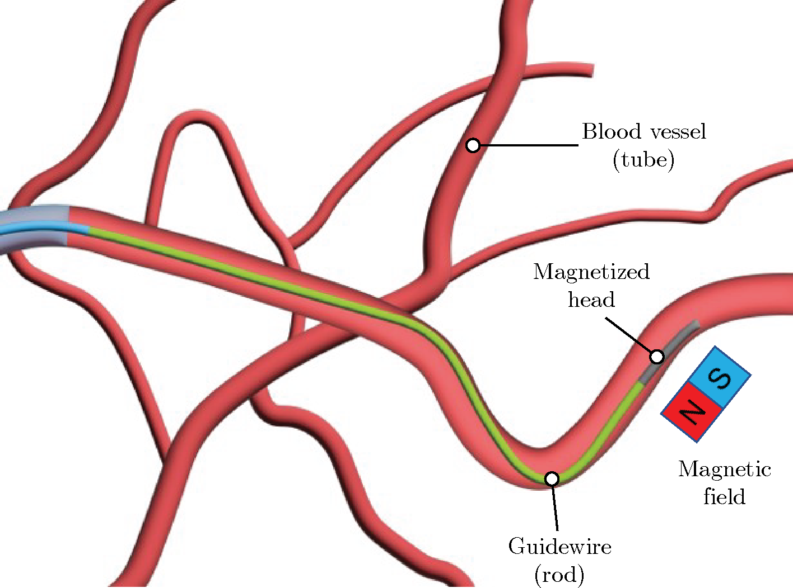
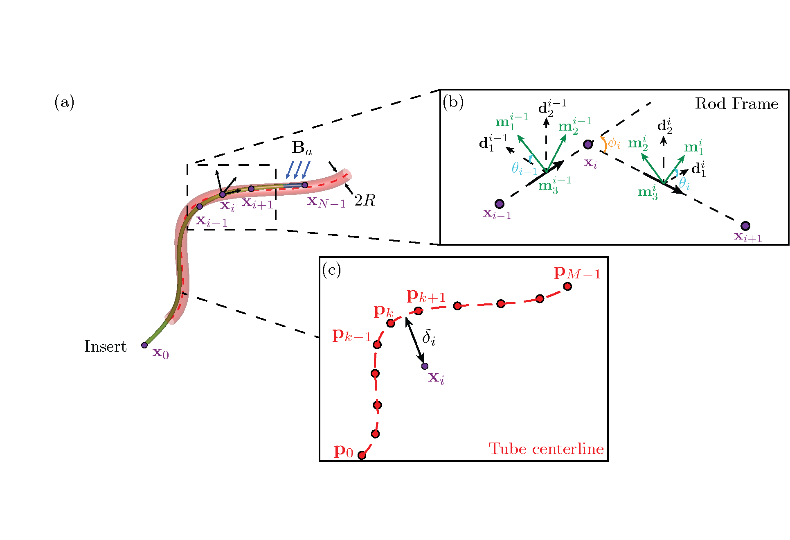
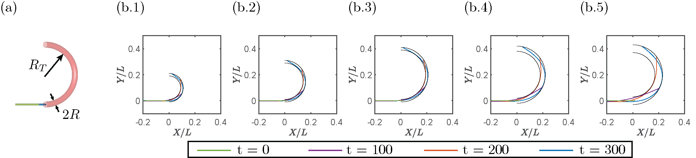
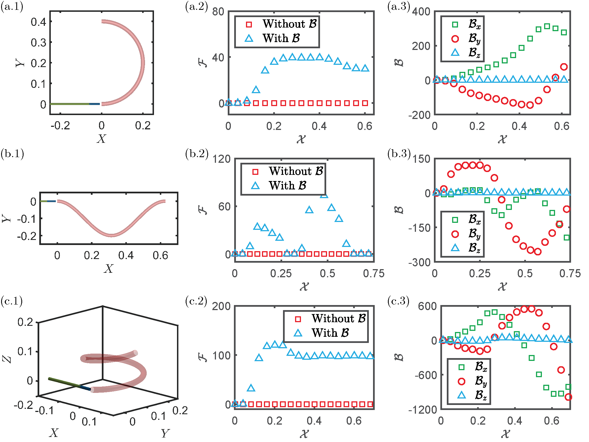
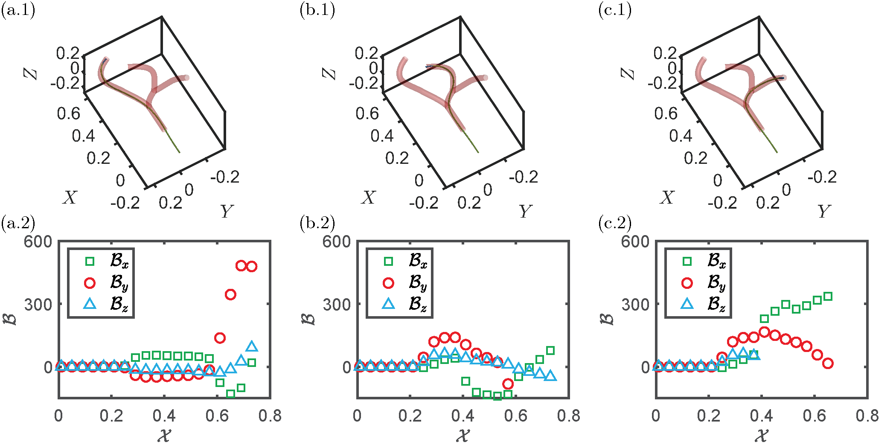

# Physics-based modeling and control of a magnetically-actuated continuum guidewire moving in blood vessels

## Simulation

  

  

## Project Preview

### Overview

  

### Schematic

  

### Planar

  

### Control

  

### Bifurcation

  

