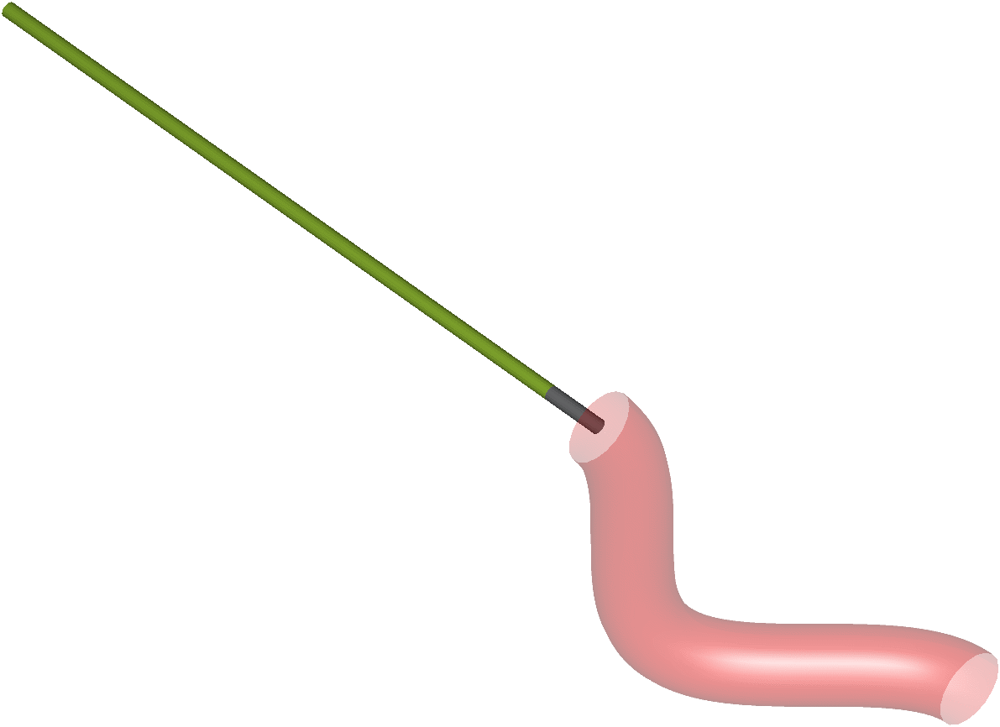
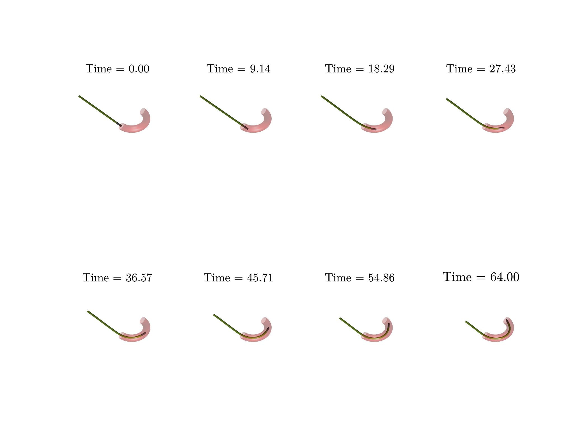
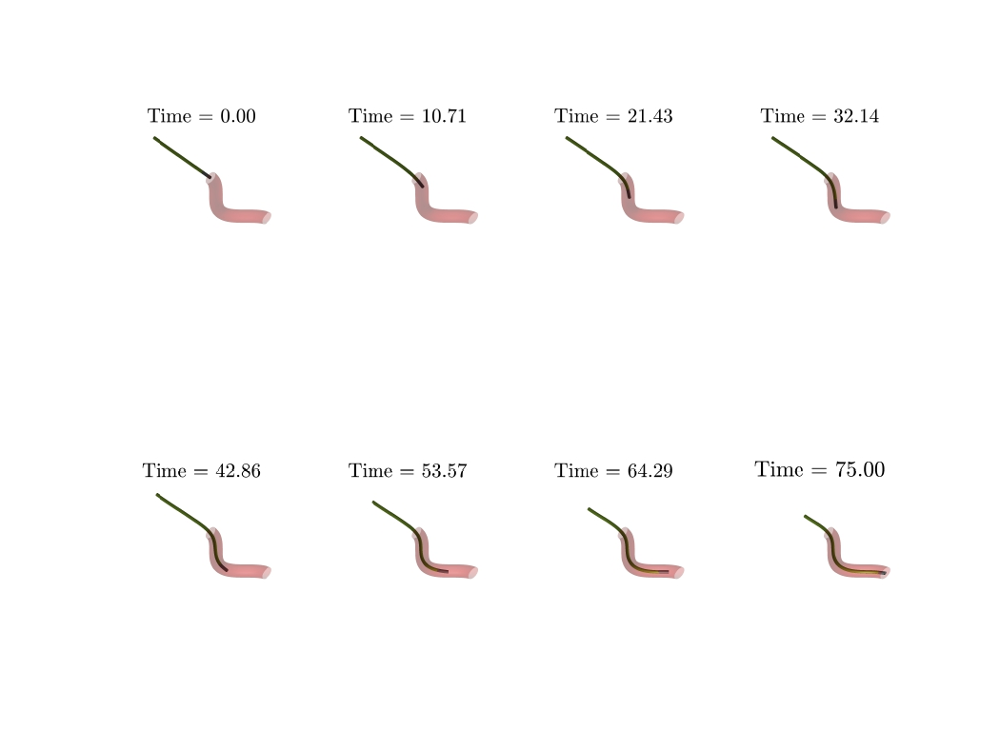
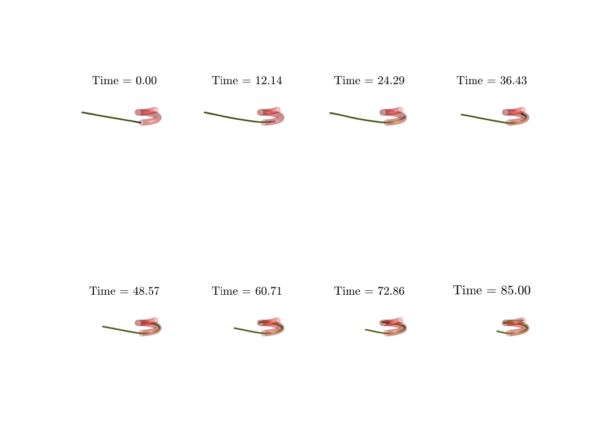

# Physics-based modeling and control of a magnetically-actuated continuum guidewire moving in blood vessels

## Simulation

  

## Test cases

  

  

  

function ba = getBa(qOld, dt, qCons, m, u, consInd, ...
                    ScaleSolver, tol, maximum_iter, ...
                    EI, EA, R, ne, refLen, mg, Nodes, ba, br)
    % m = 0.001*m;

    method = "momentum";

    % Parameters
    lr = 1e2*norm(ba);            % Learning rate for gradient descent
    max_iter = maximum_iter; % Maximum number of iterations
    tol_grad = 1e-3;       % Tolerance for gradient norm

    if method == "momentum"
        gamma = 0.9;
        momentum = [0;0];
    elseif method == "linesearch"
        alpha = 0.5;
        beta = 0.5;
    else
        error("Please specify the method.")
    end
    
    for iter = 1:max_iter

        gradient = getGrad(qOld, dt, qCons, m, u, consInd, ...
            ScaleSolver, tol, maximum_iter, ...
            EI, EA, R, ne, refLen, mg, Nodes, ba, br);

        % Check for convergence
        grad_norm = norm(gradient);
        if grad_norm < tol_grad
            fprintf('Converged in %d iterations.\n', iter);
            break;
        end
        
        if method == "momentum"
            momentum = gamma*momentum + lr * gradient;
            ba = ba - momentum;
        elseif method == "linesearch"
            step_size = 1.0;
            loss_old = getLoss(qOld, EI, EA, R, ne, refLen, mg, Nodes, ba, br);
            while true
                ba_new = ba - step_size*gradient;
                loss_new = getLoss(qOld, EI, EA, R, ne, refLen, mg, Nodes, ba_new, br);
                if loss_new <= loss_old - beta * step_size * grad_norm^2
                    break;
                end
                step_size = alpha * step_size;
            end
            ba = ba_new;
        else
            break
        end
    end
    
    if iter == max_iter
        fprintf('Reached maximum iterations (%d) with gradient norm %.6e.\n', ...
                max_iter, grad_norm);
    end
end
